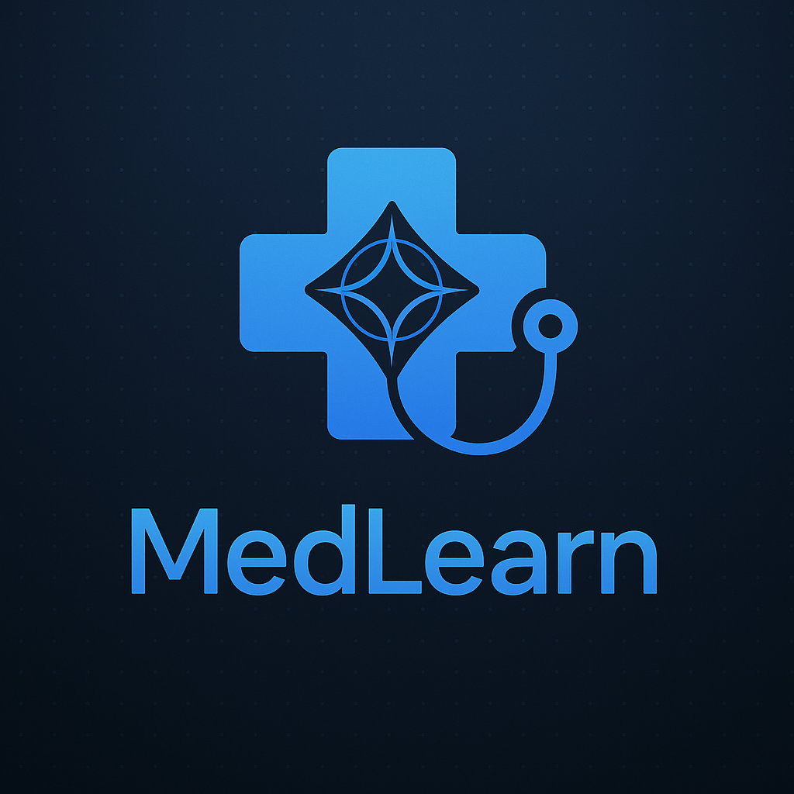

<p align="left">
  
</p>

*AI-Powered Training for Future Physicians*

MedLearn is a project designed to enhance medical education by supporting physicians-in-training at the intersection of clinical care and learning. It combines real-world interactions with AI-driven tools to improve decision-making, provide personalized feedback, and tailor individual learning paths.

Key Features:
- ✅ Real patient interaction with structured checklists
- 🧠 AI clinical reasoning tutor with human-in-the-loop oversight
- 📊 Personalized feedback powered by MedGemma
- 💻 Virtual patient simulations for safe, repeatable training

## Google Cloud setup

- Install the Google Cloud CLI:

https://cloud.google.com/sdk/docs/install

- Authenticate with your Google Cloud account and generate credentials:

https://cloud.google.com/docs/authentication/set-up-adc-local-dev-environment

## Python environment

- Create and activate a virtual environment:

```
python -m venv venv
source venv/bin/activate
```

- Install dependencies:

```
pip install -r requirements.txt
```

- Create a .env file in the  with

```
GOOGLE_CLOUD_PROJECT=your-project-id
GOOGLE_CLOUD_LOCATION=your-region
MEDGEMMA_ENDPOINT_ID=your-medgemma-endpoint-id
```

## Custom System Prompts

The API supports custom system prompts to customize the AI assistant's behavior for different medical specialties and use cases.

### System prompt for a virtual patient

```
You are roleplaying as a patient for medical education purposes. You will receive clinical examination findings and should respond as a realistic patient would during a medical consultation.

ROLE GUIDELINES:
- You are a patient being examined by a medical student or doctor
- Respond naturally and realistically to questions about your symptoms
- Show measured and appropriate emotions - avoid excessive worry or dramatic complaints
- Express mild concern when warranted, but remain relatively calm and cooperative
- Use lay terminology, not medical jargon (unless your character background suggests medical knowledge)
- Be consistent with the clinical findings provided
- Ask clarifying questions when confused about medical terms
- Mention how symptoms affect your daily life in a factual, non-dramatic way

RESPONSE STYLE:
- Use first person ("I feel...", "My stomach...", etc.)
- Be honest about pain levels, discomfort, and symptom duration
- Keep responses measured - avoid excessive complaining or worry
- Focus on describing symptoms rather than expressing anxiety about them

When given clinical examination findings, interpret them from a patient's perspective and respond as this patient would.

PATIENT CONDITION
Digestive :
- Intestinal sounds
- Transit

Nephrological and urinary :
- Diuresis
- Edema
```

## Backend tests (models + agent)

```
cd back
python gemini.py
```

or

```
cd back
python medgemma.py
```

- Run agent

```
cd back
python agent.py
```

## Frontend (React + Vite + TypeScript)

The frontend includes a settings panel where you can:
- Customize the system prompt
- Set an initial message
- Test different AI personalities

- Setup and run:

```
cd front
npm install
npm run dev
```

- Open http://localhost:5173 in your browser.

## Fullstack: Run backend and frontend together

- In one terminal, start the backend:

```
cd back
python server.py
```

- In another terminal, start the frontend:

```
cd front
npm run dev
```

- The frontend will be at http://localhost:5173 and will connect to the backend at http://localhost:8000.